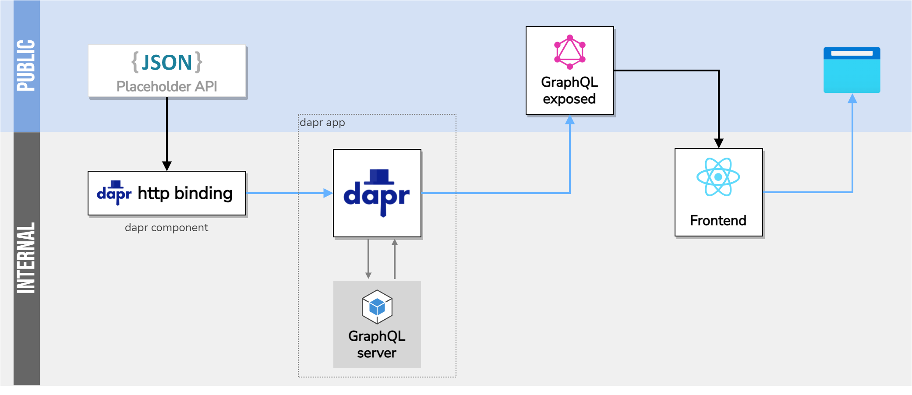

## Overview
***
This challenge consists on creating a reader app (facebook clone) that displays content from a [GraphQL](https://graphql.org/) microservice running on [Dapr](https://dapr.io/).

JSON Placeholder provides a [public API](https://jsonplaceholder.typicode.com/) with a basic data set to build a simple social media PoC.

Feel free to unleash your creativity and create your own UI/UX design 🚀🚀.

## Instructions

* Create a public GitHub repository to host the project codebase. You will share that repo with us.
* Install Dapr locally as a self-hosted dev environment. The Dapr runtime should make use of the [GraphQL binding](https://docs.dapr.io/reference/components-reference/supported-bindings/graghql/).
* Make sure to use [Next.js](https://nextjs.org/), or embedded Go templates using: [Alpine](https://alpinejs.dev/), [HTMX](https://htmx.org/).

## Features

### Backend
* Use Golang for the 2 services
   * GraphQL API
   * HTTP Binding consuming the jsonplaceholder API
* Add Unite tests
* Create containers for both services

### Web Frontend
* Show posts that include:
    * Comments of each post
    * Author: The username of the item (post & comment)
    * Text: The post text
    * Time: Date & time when it was published
    * Count of total comments
        * Author: The username of the author of the comment
        * Text: The content of the comment
        * Time: Date & time when it was published
        * Replies: List of the replies and reply count
    * Url: The URL of the story (optional)
* Comments toggle for each post
* Filters: The user should be able to filter the content displayed by:
    * All: Show all items
    * Stories: Show only "story" items
    * Jobs: Show only "job" items
    * Polls: Show only "poll" items
* The author should have a link to the user information that includes:
    * Id: The user's unique username. Make it case sensitive
    * About: The users's optional self description
    * Created: Creation date of the user
    * Submitted: List of user stories, polls and comments
* The data must be retreived by the GraphQL service that you build
* The project should include unit tests for the buisiness logic
* Include code comments for documenting your project

## Evaluation Criteria
* Completeness: did you complete all the features?
* Correctness: does the functionality behave in sensible, thought-out ways?
* Maintainability: is the code it written in a clean, maintainable way?
* Testability: is the system adequately tested?
* Documentation: is the Web Application well-documented?
* Atomic commit history
* Code quality
  * Performance
  * Thread safety
  * Code readability
  * Best practices

## Tips
Layout your code in a well structured way. Think of this project as if it was going to be published in production. Do your commits in a way that show well separated additions of fucntionality. 

**All the best and happy coding,**

The Urth Team.
